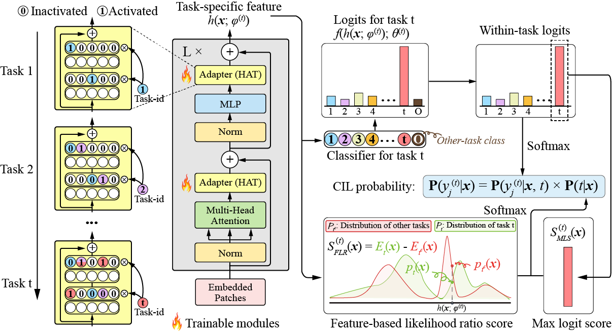

# Class Incremental Learning via Likelihood Ratio Based Task Prediction

This repository contains the code for our paper [Class Incremental Learning via Likelihood Ratio Based Task Prediction](https://github.com/linhaowei1/TPLR#) by [Haowei Lin](https://linhaowei1.github.io/), [Yijia Shao](https://shaoyijia.github.io/), Weinan Qian, Ningxin Pan, Yiduo Guo, and [Bing Liu](https://www.cs.uic.edu/~liub/).

## Quick Links

- [Overview](#overview)
- [Requirements](#requirements)
- [Training](#training)
- [Evaluation](#evaluation)
- [Bugs or Questions?](#bugs-or-questions)
- [Acknowledgements](acknowledgements#)
- [Citation](#citation)

## Overview



Predicting the task-id for each test sample is a challenging problem in CIL. An emerging theoretically justified and effective approach is to train a task-specific model for each task in a shared network for all tasks based on a *task-incremental learning* (TIL) method to deal with forgetting. The model for each task in this approach is an OOD detector rather than a conventional classifier. The OOD detector can perform both *within-task* (*in-distribution* (IND)) class prediction and OOD detection. The OOD detection capability is the key for task-id prediction during inference for each test sample. However, we argue that using a traditional OOD detector for task-id prediction is sub-optimal because additional information (e.g., the replay data and the learned tasks) available in CIL can be exploited to design a better and **principled method for task-id prediction**. We call the new method **TPLR** (***T***ask-id ***P***rediction based on ***L***ikelihood ***R***atio).

## Requirements

First, install PyTorch by following the instructions from [the official website](https://pytorch.org/). Please use the correct 1.6.0 version corresponding to your platforms/CUDA versions to faithfully reproduce our results. PyTorch version higher than `1.6.0` should also work. For example, if you use Linux and **CUDA11** ([how to check CUDA version](https://varhowto.com/check-cuda-version/)), install PyTorch by the following command,

```
pip install torch==1.6.0+cu110 -f https://download.pytorch.org/whl/torch_stable.html
```

If you instead use **CUDA** `<11` or **CPU**, install PyTorch by the following command,

```
pip install torch==1.6.0
```

Then run the following script to install the remaining dependencies,

```
pip install -r requirements.txt
```

**Attention**: Our model is based on `timm==0.4.12`. Using them from other versions may cause some unexpected bugs.

## Training

In the following section, we describe how to train the TPLR model by using our code.

**Data**

Before training and evaluation, please download the datasets (CIFAR-10, CIFAR-100, TinyImageNet). The default working directory is set as ``~/data`` in our code. You can modify it according to your need.

**Pre-train Model**

We use the pre-train DeiT model provided by [MORE](https://github.com/k-gyuhak/MORE). Please download it and save the file as ``./deit_pretrained/best_checkpoint.pth``

**Training scripts**

We provide all the example training scripts to run TPLR. e.g., for C10-5T, train the network using this command:

```bash
bash scripts/deit_C10_5T.sh
```

For the results in the paper, we use Nvidia GeForce RTX2080Ti GPUs with CUDA 10.2. Using different types of devices or different versions of CUDA/other software may lead to slightly different performance.

## Evaluation

Continue with the C10-5T example. Once you finished training, come back to the root directory and simply run this command:

```bash
bash scripts/deit_C10_5T_eval.sh
```

The results for the first sequence with `seed=2023` will be saved in `./data/seq0/seed2023/progressive_main_2023`.

## Bugs or questions?

If you have any questions related to the code or the paper, feel free to email [Haowei](mailto:linhaowei@pku.edu.cn). If you encounter any problems when using the code, or want to report a bug, you can open an issue. Please try to specify the problem with details so we can help you better and quicker!

## Acknowledgements

We thank [PyContinual](https://github.com/ZixuanKe/PyContinual) for providing an extendable framework for continual learning. We use their code structure as a reference when developing this code base.

## Citation

Please cite our paper if you use this code or part of it in your work:

```bibtex
@inproceedings{lin2023class,
   title={Class Incremental Learning via Likelihood Ratio Based Task Prediction},
   author={Lin, Haowei and Shao, Yijia and Qian, Weinan and Pan, Ningxin and Guo, Yiduo and Liu, Bing},
   year={2023}
}
```